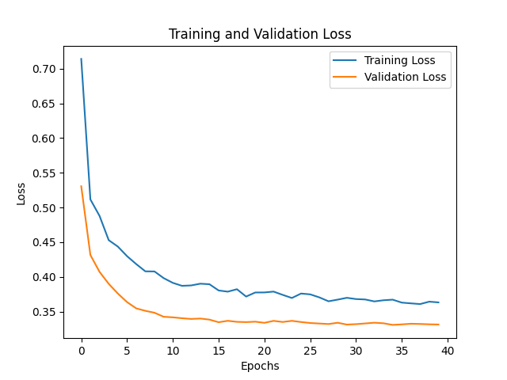

# 🧠 ANN Customer Churn Classification End-to-End Deployment Project
For more details, check out the [project repository on GitHub](https://github.com/dannyyqyq/ANN_Classification_churn).

## 🚀 Web Application
Experience the Customer Churn Prediction live!  
[Live Demo: Customer Churn Prediction](https://ann-churn-prediction.streamlit.app/)

## 📌 Project Overview
This project uses Artificial Neural Networks (ANN) to predict customer churn for a bank, helping businesses retain customers by identifying at-risk individuals. It leverages a dataset of customer records from a bank, processed with TensorFlow/Keras for classification. The project covers:

- **Data Ingestion**: Loading and preparing customer data from CSV files for analysis.
- **Data Transformation**: Preprocessing and encoding categorical data for model training.
- **Model Training**: Training an ANN to classify customers as likely to churn or not.
- **Prediction Pipeline**: Applying the trained model to predict churn for new customer data.
- **Web Application**: A Streamlit-based interface for users to input customer data and get churn predictions.
- **Deployment**: Deployed on Streamlit Cloud for live access.

## 🛠 Tools and Technologies Used

### 🚀 Deployment
- **Streamlit**: 
  - Provides an interactive web interface for real-time churn predictions.

### 📊 Machine Learning
- **Classification Model**: 
  - Artificial Neural Network (ANN) built with TensorFlow/Keras, including multiple dense layers, batch normalization, and dropout for regularization.
- **Feature Engineering**: 
  - StandardScaler for numerical features, OneHotEncoder/FunctionTransformer for categorical features. The model’s performance is detailed in the repository’s documentation or logs.
- **Model Evaluation**:

  | Metric              | Value    |
  | ------------------- | -------- |
  | Accuracy            | 0.8687   |
  | Precision (Churn=1) | 0.7513   |
  | Recall (Churn=1)    | 0.4863   |
  | F1-Score (Churn=1)  | 0.5904   |

  *Note: Values may vary slightly based on dataset splits and hyperparameters.*

## 📂 Project Structure

```plaintext
ANN_Classification_churn/
├── artifacts/
│   ├── model.h5
│   ├── preprocessor.pkl
│   ├── loss_images/
│   │   └── loss_plot.png
│   ├── tensorlogs/
│       ├── train/
│       │   └── tensorfiles*  # TensorBoard logs for training
│       └── valid/
│           └── tensorfiles*  # TensorBoard logs for validation
├── data/
│   └── churn_data.csv (CSV not pushed to repo)
├── src/
│   ├── components/
│   │   ├── __init__.py
│   │   ├── data_ingestion.py
│   │   ├── data_transformation.py
│   │   └── model_trainer.py
│   ├── utils.py
│   ├── exception.py
│   ├── logger.py
├── .gitignore
├── .pre-commit-config.yaml
├── Dockerfile
├── README.md
├── app.py
├── main.py
├── requirements.txt
└── setup.py
```

## 🚀 How It Works

### 1️⃣ Data Ingestion
- Loads customer churn data from a CSV file (e.g., 10,000 records from a bank dataset) and saves it for further processing.
- Splits the dataset into train and test sets to prevent data leakage when preprocessing.
  
Here's a snippet from `data_ingestion.py`:
```python
  def initiate_data_ingestion(self):
      try:
          df = pd.read_csv(self.ingestion_config.base_data_path)
          logging.info("Read the dataset as dataframe")
          directory = os.path.dirname(self.ingestion_config.raw_data_path)
          os.makedirs(directory, exist_ok=True)
          df.to_csv(self.ingestion_config.raw_data_path, index=False)
          return df, self.ingestion_config.raw_data_path
      except Exception as e:
          raise CustomException(e, sys)

      logging.info("Train test split initiated")
      train_set, test_set = train_test_split(df, test_size=0.3, random_state=42)

      train_set.to_csv(
          self.data_ingestion_config.train_data_path, index=False, header=True
      )

      logging.info(f"Train dataframe shape: {train_set.shape}")
      test_set.to_csv(
          self.data_ingestion_config.test_data_path, index=False, header=True
      )
```

### 2️⃣ Data Transformation
- Transforms labels (e.g., gender) to binary (0 and 1) and preprocesses data by encoding categorical variables and scaling numerical features.
- Preprocessing steps are done in a pipeline manner and saved as a preprocessor object.  
  
Here's a snippet from `data_transformation.py.py`:
```python
  # Separate numerical and categorical columns
  numerical_cols = df.select_dtypes(include=['int64', 'float64']).columns
  categorical_cols = df.select_dtypes(include=['object']).columns

  # Scale numerical features
  scaler = StandardScaler()
  df[numerical_cols] = scaler.fit_transform(df[numerical_cols])

  # Encode categorical features
  encoder = OneHotEncoder(sparse=False, handle_unknown='ignore')
  encoded_cats = encoder.fit_transform(df[categorical_cols])
  encoded_df = pd.DataFrame(encoded_cats, columns=encoder.get_feature_names_out(categorical_cols))
```  
Here's a snippet from `data_transformation.py.py` for the pipeline:
```python
  def get_data_transformer(self):
      """Creates and returns a data preprocessing pipeline."""
      cols_one_hot_encoder = ["Geography"]
      preprocessor = Pipeline(steps=[
          ("gender_transform", FunctionTransformer(self.gender_transformer, validate=False)),
          ("one_hot_encoder", ColumnTransformer(
              transformers=[
                  ("Geography_OHE", OneHotEncoder(handle_unknown="ignore"), cols_one_hot_encoder)
              ],
              remainder="passthrough"
          )),
          ("scaler", StandardScaler())])
      return preprocessor
```

### 3️⃣ Model Training
- Trains an ANN using TensorFlow/Keras to predict customer churn.
- Uses early stopping, batch normalization, and dropout as regularization techniques.
- The trained model is saved as an object for deployment.

**Training and Validation Loss:**



*This plot shows the training and validation loss over epochs. It illustrates the model's learning progress and helps identify potential overfitting or underfitting.*

A snippet from `model_trainer.py`:
```python
  def initiate_ann_model(self, X_train, y_train, X_test, y_test):
      model = Sequential([
          Dense(64, activation="relu", input_shape=(X_train.shape[1],)),
          tf.keras.layers.BatchNormalization(),
          tf.keras.layers.Dropout(0.3),
          Dense(32, activation="relu"),
          tf.keras.layers.BatchNormalization(),
          tf.keras.layers.Dropout(0.3),
          Dense(16, activation="relu"),
          tf.keras.layers.BatchNormalization(),
          tf.keras.layers.Dropout(0.3),
          Dense(1, activation="sigmoid"),
      ])

      model.compile(
          optimizer=tf.keras.optimizers.Adam(learning_rate=0.001),
          loss=tf.keras.losses.BinaryCrossentropy(),
          metrics=["accuracy"],)
```
A snippet from `model_trainer.py` for saving the model:
```python
  def initiate_model_trainer(self, train_array, test_array):
          .....
          # Initialize and train the model
          model = self.initiate_ann_model(X_train, y_train, X_test, y_test)
          # Save the trained model
          model.save(self.model_trainer_config.trained_model_file_path)
          logging.info(
              f"Model saved at: {self.model_trainer_config.trained_model_file_path}"
          )
          return model
```

### 4️⃣ Prediction Pipeline
- Loads the trained model and preprocessor object to transform and predict churn for new customer data.
  
A snippet from `model_trainer.py`:
```python
  # Load preprocessor
  logging.info("Loading preprocessor...")
  preprocessor = load_object(data_transformation_config.preprocessor_obj_file_path)
  logging.info("Preprocessor loaded successfully.")

  # Check if model file exists
  if not os.path.exists(model_trainer_config.trained_model_file_path):
      raise FileNotFoundError(
          f"Trained model file not found: {model_trainer_config.trained_model_file_path}")

  # Load model
  logging.info("Loading model...")
  model = tf.keras.models.load_model(model_trainer_config.trained_model_file_path)
  logging.info("Model loaded successfully.")
```

### 5️⃣ Web Application
- Uses Streamlit to allow users to input customer data and view churn predictions.
  
A snippet from `app.py`:
```python
  st.title("Customer Churn Prediction")
  # User input
  credit_score = st.number_input("Credit Score", min_value=0)
  geography = st.selectbox("Geography", ["France", "Germany", "Spain"])
  gender = st.selectbox("Gender", ["Male", "Female"])
  age = st.slider("Age", min_value=18, max_value=92)
  tenure = st.slider("Tenure", min_value=0, max_value=10)
  balance = st.number_input("Balance", min_value=0)
  num_of_products = st.slider("Number of Products", min_value=1, max_value=4)
  has_credit_card = st.selectbox("Has Credit Card", [0, 1])
  is_active_member = st.selectbox("Is Active Member", [0, 1])
  estimated_salary = st.number_input("Estimated Salary", min_value=0)
  ...
  # Prediction Churn
  prediction = model.predict(input_data_transformed)
  prediction_proba = prediction[0][0]
  # Display prediction
  if prediction_proba < 0.5:
      st.write("The customer is not likely to churn.")
  else:
      st.write("The customer is likely to churn.")
```

### 6️⃣ Deployment
- **Streamlit Cloud**: Deployed directly on Streamlit Cloud for web access. No Docker required for cloud deployment. The app uses Streamlit’s managed environment.

## 💻 Running the Project
### 🏗️ Local Development
1. **Install Dependencies**:
   ```bash
    pip install -r requirements.txt
   ```
2. **Run Data Pipeline**:

    A snippet from `main.py`:
    ```python
      data_ingestion_obj = DataIngestion()
      df = data_ingestion_obj.initiate_data_ingestion()
      train_array, test_array, _, _ = 
      DataTransformation().initiate_data_transformation(DataIngestionConfig().train_data_path,
      DataIngestionConfig().test_data_path)
      ModelTrainer().initiate_model_trainer(train_array, test_array)
    ```
3. **Start Streamlit Server**:
   ```bash
    streamlit run app.py
   ```

## ⚠️ Challenges Faced

* **Label imbalance:**
  - Approxmiately 80:20 for the labels which will affect the model being heavily biased towards predicted non-churn cases, resulting in poor performance on the minority (churn) class.
* **Model Metric:**
  - Approximately 80:20 split for non-churn:churn, causing the model to be heavily biased toward predicting non-churn cases, resulting in poor performance on the minority (churn) class. This imbalance led to an accuracy of around 86%, but only a recall score of 48%, meaning the model correctly identifies about 49% of actual churn cases.
  - Using the F1-score for a more balanced evaluation, the model achieves 59%, confirming suboptimal performance on the minority class (churn). Missing churn cases could lead to lost revenue for the bank, highlighting the need for improved recall.

## 🔮 Next Steps / Potential Improvements

* **📈 Model Enhancement and Data Imbalance Handling:**
    * **Addressing Data Imbalance:**
        * Given the observed class imbalance, we can explore techniques such as oversampling (e.g., SMOTE), undersamplingto improve the model's performance on the minority class (churn).
        * We will focus on optimizing recall to ensure that we capture a higher percentage of actual churn cases, as this is crucial for effective customer retention.
    * **Architecture and Hyperparameter Tuning:**
        * Experiment with deeper architectures (e.g., LSTM, CNN) or hyperparameter tuning using grid search to maximize model performance.
    * **Evaluation Metrics:**
        * Prioritize recall and F1-score optimization, as accuracy alone is misleading for imbalanced data.
* **🧪 Automated Testing and CI/CD:**
    * Implement unit tests for data preprocessing, model training, and prediction pipelines to ensure code reliability.
    * Set up CI/CD pipelines to automate testing and deployment of the model.
  
🔥  This project showcases my end-to-end journey in building and deploying an artificial neural network using TensorFlow/Keras, with a focus on optimization and regularization for improved model accuracy. 🚀